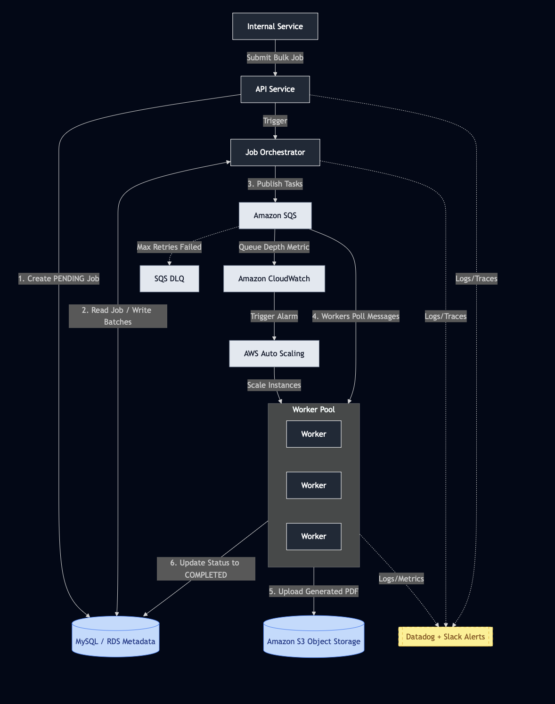
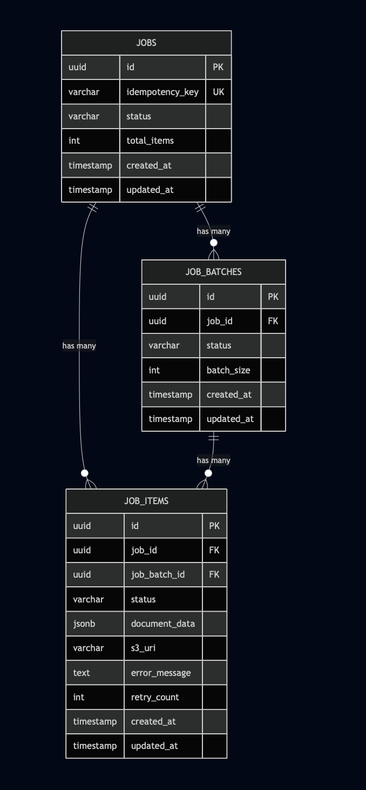

# Bulk PDF Generation System — Architecture Document

> **Note:** This document outlines the high-level architecture and design of the system. For technical implementation details, setup instructions, and API references, please refer to the [System Documentation](./bulkPDFGenerationSystem/README.md).

## Architecture Overview
...

**Purpose:** A backend service that accepts large bulk PDF generation requests (thousands → hundreds of thousands), generates PDFs asynchronously, stores them for retrieval, and exposes job status and failures.

**Core components and responsibilities:**
To meet the requirement of generating PDFs in bulk reliably and at scale, the system leverages an asynchronous, event-driven architecture using AWS-native concepts.

* **API Service:** A lightweight web service (e.g., FastAPI/Flask) that accepts job requests, validates inputs, creates the initial job records, and queries job statuses.
* **Job Orchestrator:** An asynchronous background process that reads job metadata, chunks massive bulk jobs into smaller, manageable batches, and publishes it to the message queue.
* **Message Queue (Amazon SQS):** A durable work queue sitting between job orchestration and PDF generation. It decouples request ingestion from processing, enables horizontal scaling, provides buffering during traffic spikes, and supports reliable retry semantics via visibility timeouts and Dead-Letter Queues (DLQ).
* **Worker Pool:** A horizontally-scalable compute fleet that pulls tasks from the queue. It executes the PDF rendering logic, uploads the raw files to object storage, and updates the task status.
* **Metadata Store (Amazon RDS):** A relational database responsible for tracking the overall state machine. It stores the hierarchy of `Job`, `JobBatches`, and `JobItem` records, including statuses, retry attempts, and S3 object URIs.
* **Object Storage (Amazon S3):** Provides highly scalable, persistent storage for the generated PDF files, leveraging lifecycle policies and encryption at rest.
* **Control Plane (CloudWatch + Application Auto Scaling):** The monitoring and scaling engine. It tracks SQS available message metrics (Queue Depth) to dynamically scale the Worker Pool out during traffic spikes and scale in when idle, optimizing for cost.
* **Monitoring & Observability (Datadog + Slack):** Centralized telemetry that aggregates metrics, logs, and distributed traces, coupled with automated alerting sent to communication channels (like Slack) for operational readiness.

---

## Component Interactions & Data Flow

### 1. Job Submission & Orchestration
* **Ingestion:** The internal caller sends an HTTP POST request to the API Service containing the bulk document payload (structured JSON) and an idempotency key.
* **Initial State:** The API Service validates the request, creates a parent `Job` record with a "PENDING" status in the Metadata Store (RDS), and immediately returns an HTTP 202 Accepted response with the `job_id`.
* **Chunking:** The API asynchronously triggers the Job Orchestrator. The Orchestrator breaks the massive payload down into smaller `JobBatches` and creates individual `JobItem` records in the database.
* **Enqueuing:** The Orchestrator publishes individual task messages (containing the `JobItem` ID and document data) to the Message Queue (SQS).

### 2. Asynchronous Processing
* **Polling:** The Worker Pool (ECS) continuously polls SQS for available messages.
* **State Update:** Upon receiving a message, a Worker updates the specific `JobItem` status from "PENDING" to "PROCESSING" in the Metadata Store.
* **Generation:** The Worker executes the core Python rendering logic (e.g., using WeasyPrint or ReportLab) to generate the PDF based on the provided JSON data.

### 3. Storage & Retrieval
* **Upload:** Once the PDF is successfully rendered in memory, the Worker uploads the raw file to Object Storage (S3).
* **Final State:** The Worker retrieves the resulting S3 Object URI and updates the `JobItem` record in the Metadata Store to "COMPLETED", saving the URI alongside it.
* **Acknowledgment:** After all `JobItem` of the batch ran finished, the Worker actively deletes the message from SQS to prevent duplicate processing. *(Note: If generation or upload fails, the worker crashes, the SQS visibility timeout expires, and the message becomes available for a retry).*

### 4. Status Retrieval
* **Polling:** The internal caller periodically polls the API Service using an HTTP GET request with their `job_id`.
* **Aggregation:** The API Service queries the Metadata Store to calculate the aggregate progress of the batch (e.g., "Status: PROCESSING. 85,000 / 100,000 Completed. 12 Failed.").
* **Delivery:** Once the job is fully complete, the API returns the final status payload, which includes the list of individual S3 URIs or all pdf as zip so the internal service can fetch the final documents.

---

## Job Lifecycle & API

* **Job states:** `PENDING` → `IN_PROGRESS` → `PARTIAL_FAILURE` / `FAILED` → `COMPLETED`
* **Job batch states:** `PENDING`, `IN_PROGRESS`, `SUCCESS`, `FAILED`, `DLQ`
* **Item states:** `PENDING`, `SUCCESS`, `FAILED`

### API Endpoint Specifications

| Endpoint | Description | Sample Request | Sample Response |
| :--- | :--- | :--- | :--- |
| **`POST /jobs`** | Submits a new bulk PDF generation job. Accepts an array of structured data and an idempotency key to prevent duplicate submissions. | `{"idempotency_key": "req-123", "items": [{"user_id": "A1", "data": {...}}, {"user_id": "B2", "data": {...}}]}` | `{"job_id": "job-9876", "status": "PENDING", "estimated_count": 2}` |
| **`GET /jobs/{job_id}`** | Retrieves the high-level status of a specific job, including the aggregation of successful vs. failed items and overall progress. | *(Empty body. Path parameter: `job_id`)* | `{"job_id": "job-9876", "status": "PROCESSING", "total_items": 2, "completed": 1, "failed": 0, "completion_percentage": 50}` |
| **`GET /jobs/{job_id}/items`** | Lists detailed statuses for individual items within a job. Useful for debugging specific rendering failures. *(Should support pagination)*. | `/jobs/job-9876/items?page=1&limit=50` | `{"items": [{"item_id": "item-1", "status": "COMPLETED"}, {"item_id": "item-2", "status": "FAILED", "error": "Missing required field"}]}` |
| **`GET /jobs/{job_id}/items/{item_id}/download`** | Generates a time-limited presigned S3 URL to securely download a specific generated PDF without exposing the raw bucket. | *(Empty body. Path parameters: `job_id`, `item_id`)* | `{"download_url": "https://s3.amazonaws.com/...&Expires=3600", "expires_in": 3600}` |
| **`POST /jobs/{job_id}/retry`** | Administrative endpoint to automatically find and re-queue any items that failed (e.g., pulling them from a DLQ). | `{"retry_strategy": "FAILED_ONLY"}` | `{"job_id": "job-9876", "retried_count": 1, "status": "PROCESSING", "message": "1 item re-queued"}` |

### Data Models

**Important Indexes:**
1.  **Faster lookups for API polling endpoints:** `idempotency_key`
2.  **Faster aggregation of items for a specific job** (for showing job summary purpose): `job_id`, `job_items_id`
3.  **Quickly find failed items for a specific job batches** (retry purpose): `job_batch_id`, `status = dlq`
4.  **Quickly find failed items for a specific job** (retry purpose): `job_batch_id`, `job_items_id`, `status = failed`

---

## Scalability Strategy

### How the System Scales with Increasing PDF Volume
* **Ingestion Resiliency (Shock Absorption):** When a caller submits a job for 100,000 PDFs, the API Service does not process them synchronously. It merely persists the metadata and delegates chunking to the Job Orchestrator. Amazon SQS acts as an elastic buffer, absorbing the massive influx of tasks without degrading the performance of the front-facing API.
* **Storage Elasticity:** Amazon S3 inherently scales to accommodate virtually unlimited storage and high-throughput write operations, requiring no manual intervention as PDF volume grows.
* **Dynamic Horizontal Scaling:** The core scaling mechanism relies on AWS Application Auto Scaling tied to Amazon CloudWatch metrics. CloudWatch continuously calculates the Backlog Per Worker (Total visible SQS messages divided by the number of active ECS worker containers). When the backlog exceeds a predefined threshold (e.g., > 20 PDFs per worker), Auto Scaling dynamically provisions additional worker containers. As the queue drains and the backlog drops, the system gracefully scales in (terminates instances) to minimize idle compute costs.

### Identification of Bottlenecks & Mitigations
While the architecture is highly scalable, distributed systems inevitably encounter bottlenecks at scale. Below are the anticipated constraints and their mitigations:

**1. CPU & Memory (The Compute Bottleneck)**
* **The Risk:** PDF rendering (via libraries like WeasyPrint or ReportLab) is notoriously CPU-bound and memory-intensive. Rendering complex tables, large images, or custom fonts can cause workers to spike in memory usage, leading to Out-Of-Memory (OOM) container crashes.
* **Mitigation:** Workers must be strictly profiled to determine their baseline RAM/CPU requirements before setting container limits. Implementation of a "circuit breaker" or strict timeout within the Python worker script to kill a rendering process that hangs, preventing a single malformed document from permanently locking up a worker thread. Instead of running the pdf generation in a large volume transactions, break it down into multiple batches, then join the multiple batches PDF back into one large PDF to prevent OOM during the generation.

**2. Database I/O and Connections (The State Thrashing Bottleneck)**
* **The Risk:** If the worker pool scales out to 1,000 instances to process a massive backlog, those 1,000 workers will simultaneously hit the RDS instance to update `job_items` statuses (`PENDING` -> `PROCESSING` -> `COMPLETED`). This high concurrency can easily exhaust database connections or max out disk IOPS.
* **Mitigation:** Deploying a proxy (e.g., Amazon RDS Proxy or PgBouncer) between the Worker Pool and the RDS database to multiplex and manage connection limits. Instead of updating the database synchronously for every single PDF, workers can be configured to process a small batch of messages (e.g., 10 at a time) and perform a bulk `UPDATE` statement, drastically reducing I/O operations.

**3. Ingestion Payload Size (The Network Bottleneck)**
* **The Risk:** Submitting hundreds of thousands of structured JSON document definitions in a single HTTP POST request can hit API Gateway payload limits (e.g., 10MB) or cause network timeouts.
* **Mitigation:** If bulk job definitions exceed standard payload limits, the API contract should be modified. Instead of sending the full JSON array in the body, the client uploads a compressed JSON file to an S3 ingestion bucket and passes the S3 URI to the `POST /jobs` endpoint. The Job Orchestrator will then stream and parse the file from S3 to chunk the tasks.

**4. API Polling Limits (The Read Bottleneck)**
* **The Risk:** If an internal client aggressively polls the `GET /jobs/{job_id}` endpoint every 1 second for a job containing 500,000 items, it will create unnecessary read pressure on the RDS database.
* **Mitigation:** Implement rate limiting on the API Service. Add a caching layer (e.g., Redis / Amazon ElastiCache) for job status aggregation, refreshing the aggregate count asynchronously rather than executing a heavy `COUNT(*)` query on the database for every single API request.

---

## Failure Handling

### Retries, Dead-Lettering, and Partial Failures
* **Handling Transient Failures (Worker Retries):** If a worker crashes due to a temporary issue (e.g., a momentary network drop during S3 upload or an Out-Of-Memory exception), it will fail to delete the message from the SQS queue. Once the SQS visibility timeout expires, the message automatically becomes available again for another worker to pick up and process.
* **Handling Deterministic Failures (Dead-Lettering):** If a document payload contains corrupt data or an unsupported font that causes the PDF renderer to permanently fail, retrying it indefinitely is a waste of compute (a "poison pill"). SQS is configured with a `maxReceiveCount` (e.g., 3). If a task fails 3 times, SQS automatically routes it to a Dead-Letter Queue (DLQ). CloudWatch monitors the DLQ and triggers a high-priority alert to the Observability layer (Datadog/Slack) for engineering investigation.
* **Partial Bulk Failures:** Because the Job Orchestrator splits a massive 100,000-document request into independent `job_items`, the failure of a single PDF has a blast radius of exactly one. The parent `Job` continues processing. The API exposes `failed_items` counts and specific error messages per item, allowing the caller to use the `POST /jobs/{job_id}/retry` administrative endpoint to selectively re-queue only the failed items once the underlying issue is resolved.

### Idempotency and Duplicate Handling
Because Amazon SQS guarantees at-least-once delivery, there is a small chance a worker might receive the same task twice. Furthermore, callers might retry entire batch submissions if they experience a network timeout. The system enforces idempotency at two distinct layers:
* **Ingestion Idempotency (The API Layer):** Callers must provide a unique `idempotency_key` (e.g., a UUID) when calling `POST /jobs`. The database enforces a strict `UNIQUE` constraint on this column. If a caller retries a successful submission, the API simply looks up the existing key and returns the previously generated `job_id` rather than triggering a duplicate batch of 100,000 PDFs.
* **Processing Idempotency (The Worker Layer):** Workers execute operations that are inherently safe to repeat. If a worker successfully generates a PDF and uploads it to S3, but crashes right before updating the MySQL database to `COMPLETED`, the visibility timeout will expire and a second worker will retry the job. The second worker will simply overwrite the exact same file in S3 (a safe `PUT` operation) and successfully update the database, resulting in a consistent final state.

---

## Operational Considerations

### 1. Ingestion Layer (API Service)
Tracking the "front door" to ensure callers can successfully submit jobs and retrieve statuses.

* **Key Metrics:**
    * **Request Rate (Throughput):** Requests per second (RPS) grouped by endpoint.
    * **Error Rate:** Percentage of HTTP 5xx (Server Errors) and HTTP 429 (Rate Limited) responses.
    * **P99 Latency:** Time taken to process the `POST /jobs` request (should be < 200ms since generation is async).
* **Recommended Alerts:**
    * 🚨 **Critical:** API 5xx Error Rate > 1% over 5 minutes. (Indicates the API is crashing or failing to talk to the database.)
    * ⚠️ **Warning:** P99 Latency > 1 second. (Indicates potential database slow-downs during job creation.)

### 2. Decoupling Layer (Amazon SQS)
Tracking the queue is the most critical indicator of system backlogs and scaling health.

* **Key Metrics:**
    * **Queue Depth (`ApproximateNumberOfMessagesVisible`):** Total pending tasks.
    * **Oldest Message Age (`ApproximateAgeOfOldestMessage`):** How long the oldest PDF request has been waiting.
    * **DLQ Depth:** Number of messages moved to the Dead-Letter Queue.
* **Recommended Alerts:**
    * 🚨 **Critical:** DLQ Depth > 0. (Any message in the DLQ means a document permanently failed after all retries and requires human intervention.)
    * ⚠️ **Warning:** Oldest Message Age > 15 minutes. (Indicates that workers are either stuck or auto-scaling is failing to keep up with incoming load.)

### 3. Processing Layer (Worker Pool)
Tracking the compute nodes handling the heavy PDF rendering logic.

* **Key Metrics:**
    * **Memory Utilization:** Percentage of RAM used per container (crucial: PDF rendering often causes memory leaks).
    * **CPU Utilization:** Percentage of compute capacity used.
    * **Processing Duration:** Time taken from pulling an SQS message to uploading the S3 object (tracked at P50, P90, P99).
* **Recommended Alerts:**
    * 🚨 **Critical:** Worker Memory Utilization > 90% across the cluster. (High risk of imminent Out-Of-Memory container crashes.)
    * ⚠️ **Warning:** Max Auto-Scaling limit reached. (System has scaled to the maximum allowed workers, but queue depth may still be growing.)

### 4. State & Storage Layer (RDS & S3)
Tracking persistence layers to prevent bottlenecks.

* **Key Metrics:**
    * **Database Connections:** Number of active connections from API and worker pool.
    * **Database Query Latency:** Time taken to execute `UPDATE` statements for job statuses.
    * **S3 5xx Errors:** Failure rates when workers attempt to upload PDFs.
* **Recommended Alerts:**
    * 🚨 **Critical:** Database connection count > 80% of maximum limit. (Indicates a massive scale-out event might crash the database.)

### 5. Business-Level Metrics
Tracking the actual value the system delivers, regardless of underlying infrastructure.

* **Key Metrics:**
    * **Job Completion Rate:** Ratio of successful `job_items` vs failed `job_items`.
    * **End-to-End Time:** Total time from initial API `POST` to final PDF being available in S3 for an entire batch.
* **Recommended Alerts:**
    * 🚨 **Critical:** Item Failure Rate > 5% within a single batch. (Indicates a systemic issue with a specific document template or data format.)

---

## Backpressure and Overload Protection

* **Message Queue as the Primary Shock Absorber:** SQS inherently provides backpressure. If callers submit 1 million PDFs in 5 minutes, the API does not attempt to force the workers to process them immediately. The queue simply grows, buffering the workers and the database from the spike.
* **API Rate Limiting & Load Shedding:** The API Service implements strict rate limiting (e.g., via AWS WAF or an API Gateway). If an internal service aggressively loops and submits jobs faster than the system's maximum designed throughput, the API will return HTTP 429 Too Many Requests, forcing the caller to back off.
* **Worker Concurrency & Batch Limits:** SQS workers are configured with a strict `MaxNumberOfMessages` per poll (e.g., 1 to 5). This prevents a single ECS container from eagerly pulling 50 heavy PDF tasks at once and crashing due to an Out-Of-Memory (OOM) error before it can process them.
* **Database Connection Pooling:** To protect the RDS Metadata Store from connection exhaustion during a massive scale-out event, an intermediary proxy (like Amazon RDS Proxy) multiplexes database connections. If 1,000 workers suddenly spin up, the proxy queues their database requests rather than allowing them to crash the database engine.

---

## Assumptions and Trade-offs

### 1. Publishing Batches to SQS vs. Individual Tasks (Cost vs. Granularity)
* **The Decision:** Instead of publishing 100,000 individual `job_task` messages to SQS for a large job, the Job Orchestrator publishes `job_batches` (e.g., 1 message containing an array of 100 tasks).
* **The Why:** Emitting 100,000 individual messages to SQS could result in API throttling and significant per-request AWS costs. Batching dramatically increases enqueuing throughput and lowers SQS costs.
* **The Trade-off:** We sacrifice granular failure isolation. If a worker picks up a batch of 100 and PDF #99 fails, the worker must implement complex logic to acknowledge the 99 successes to the database and individually dead-letter the 1 failure, rather than relying purely on SQS's native message retry. We accepted this complexity in the worker code to gain massive cost savings at the message broker level.

### 2. Dedicated Message Broker (SQS) vs. Database Polling
* **The Decision:** We explicitly use Amazon SQS to manage the work queue rather than having the worker pool continuously poll the RDS database (e.g., executing `SELECT * FROM job_items WHERE status = 'PENDING'`).
* **The Why:** Using a relational database as a high-throughput queue is a notorious scaling anti-pattern. If hundreds of workers continuously poll the database, it creates severe CPU contention, exhausts connection limits, and requires complex row-locking mechanisms (`SELECT FOR UPDATE SKIP LOCKED`). SQS natively handles concurrency, visibility timeouts, and scales infinitely without taxing the core database engine. Most importantly, it is easier to do re-ops to retry the failure generation again.
* **The Trade-off:** We introduce an additional piece of infrastructure to provision, monitor, and pay for. It also introduces eventual consistency—the worker must now orchestrate state between the message broker (SQS) and the source of truth (RDS), requiring strict idempotency to ensure they do not drift out of sync if a worker crashes mid-process.